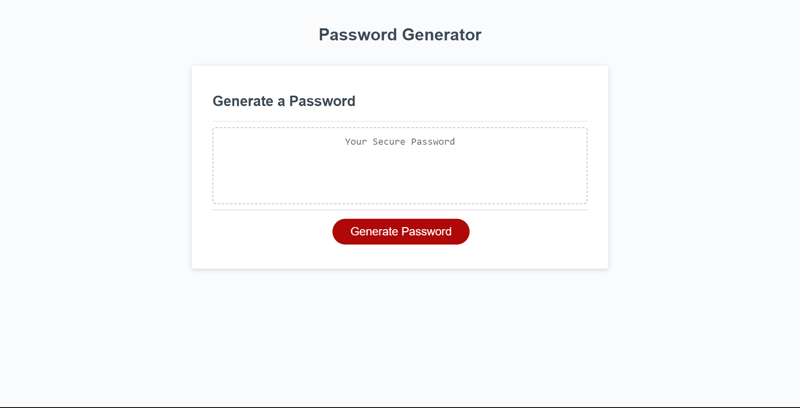
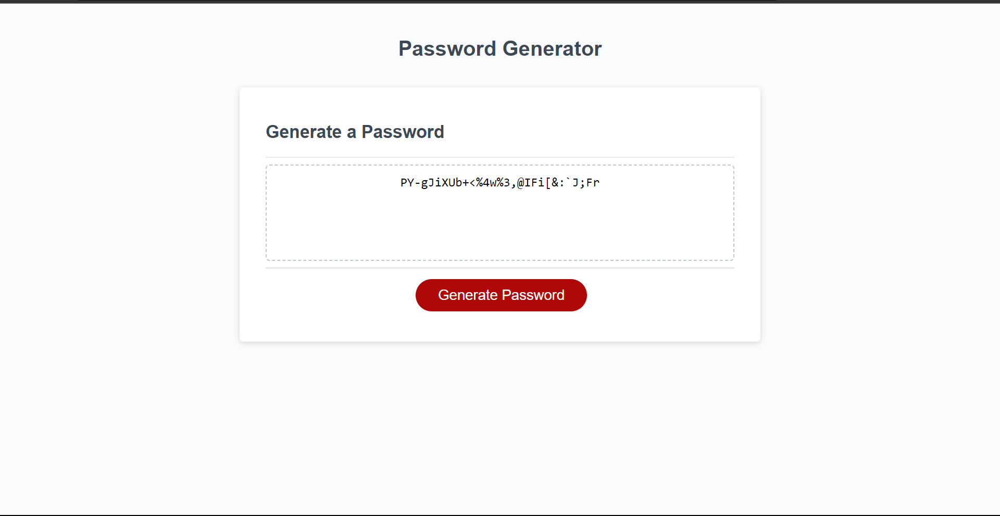

# 03-JS-Password-Generator

## Description

This is an application created to generate passwords depending on criteria input by the user. The user can choose if their password is anywhere from 8-128 characters in length and includes uppercase letters, lowercase letters, numbers, or special characters.

You can test it out right here: [Deployed Link](https://abi-gail17.github.io/03-JS-Password-Generator/)

## Table of Contents
[Screenshots](#screenshots-of-application)
[Credit](#credit)
[Installation](#installation)
[License](#license)

## Screenshots of Application

## Credit

Base code provided by UofT Coding Bootcamp

## Installation

N/A

## License

License in repo
